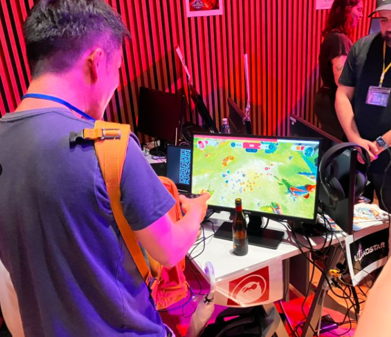
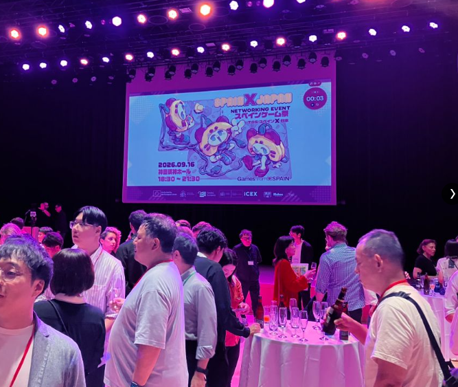

Thanks to the [Economic and Commercial Office of Spain in Japan](https://www.linkedin.com/company/oficina-econ%C3%B3mica-y-comercial-de-la-embajada-de-espa%C3%B1a-en-tokio/?lipi=urn%3Ali%3Apage%3Ad_flagship3_detail_base%3BY1cKIccWQImrul9c3pzHSQ%3D%3D) for the invitation to the Spain Game Matsuri 2026 last week in Tokyo.

Having spent years in Barcelona before moving to Japan, it was great to see both sides of the industry in one room. 

Always good to connect with people building interesting things. Looking forward to the next one and to the paella!

